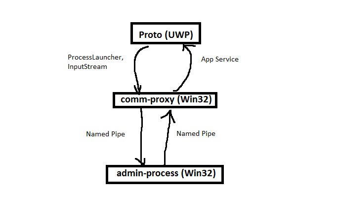

# UWP2Win32

**Testing UWP-Win32 interaction**

UWP process `proto.exe` talks to Win32 process `comm-proxy.exe` by launching it (`ProcessLauncher` API) and streaming data into its input stream. When `comm-proxy.exe` receives data, it then writes it into a named pipe set up by the `admin-process.exe`. The `admin-process.exe` responds via the named pipe, after which `proto.exe` replies back to the UWP app.

## How to set up

All prototype code is under the `proto` directory.

1. Build the solution
2. Launch `admin-process.exe` with no parameters.
3. Start `proto` UWP app and click the "Start Proxy" button. This starts `comm-proxy.exe`.
4. Type something in the edit box and hit "Send". The string goes to the `admin-process`, which upper-cases it and responds back.

You can monitor activity in `admin-process`
